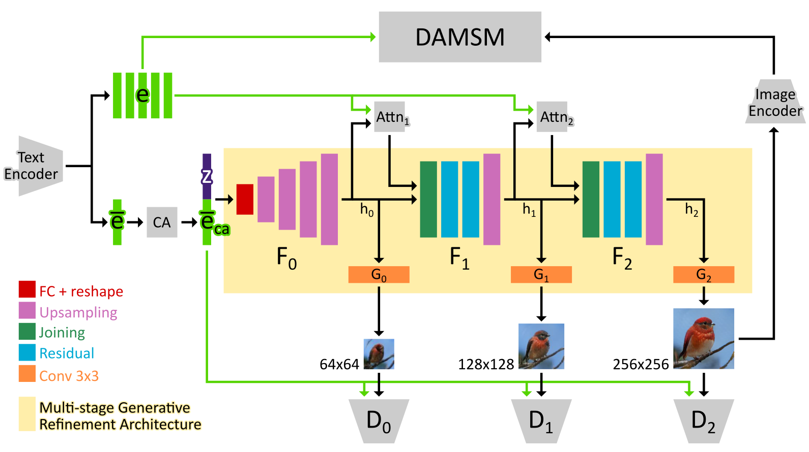
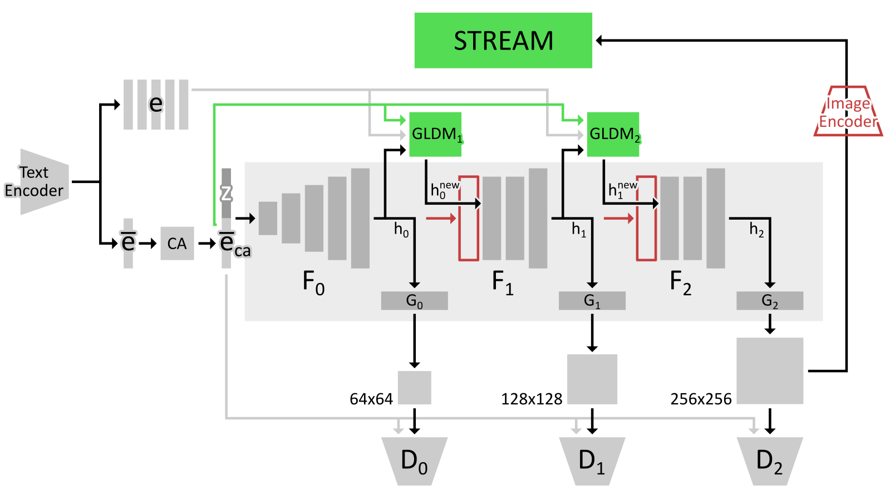
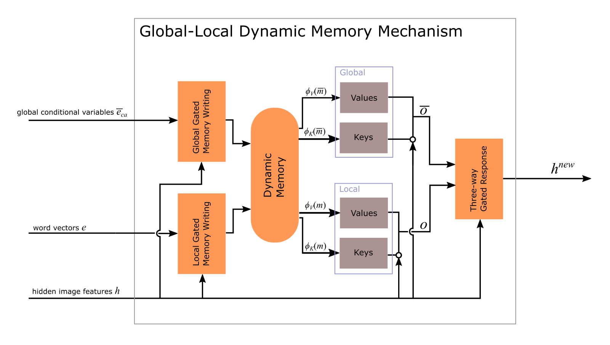
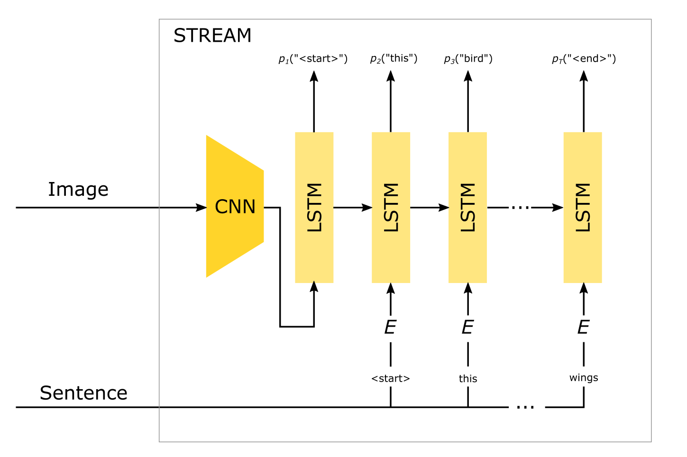

# DMM-GAN: Global-Local Dynamic Memory and Redescription Objective for Direct Text-to-Image Synthesis using Fine-Grained Data

This is the repository containing the code for our master’s thesis. We study three multi-stage GANs: AttnGAN, MirrorGAN, DM-GAN, and contribute with the fusion of key ideas from these methods. Our final proposed model is called Dynamic Memory Mirrored Generative Adversarial Network (DMM-GAN). The DMM-GAN architecture is best illustrated via its modifications made in relation to AttnGAN. Figure 1 and Figure 2 together illustrate these modifications.

## Figure 1 (AttnGAN)

An overview of the AttnGAN architecture. This architecture is fundamental for DMM-GAN. At its core, AttnGAN is a multi-stage generative refinement network that utilizes word-level information between stages via an attention mechanism. The generated bird images are taken directly from the original paper.

## Figure 2  (DMM-GAN)

An overview of our DMM-GAN architecture in relation to AttnGAN. This figure illustrates DMM-GAN's additions/changes (green) and removed parts (red). For this method, the DAMSM loss is replaced by the Semantic Text REgeneration and Alignment Module (STREAM), which is used to produce a caption redescription loss. The DAMSM image encoder is therefore removed, since STREAM contains its own image encoder. Furthermore, attention mechanisms are replaced by global-local dynamic memory mechanisms (GLDM), and as a result, hidden image features are no longer passed directly to next stages. The joining operation is therefore not needed.   

The details of STREAM and GLDM are shown in the following illustrations.

  

We credit Zhang et al. (https://github.com/hanzhanggit/StackGAN-v2) , Zu et al. (https://github.com/taoxugit/AttnGAN), Qiao et al. (https://github.com/qiaott/MirrorGAN), and Zhu et al. (https://github.com/MinfengZhu/DM-GAN) for providing implementations of their respective methods. Our code is based on the github repositories related to these methods.

